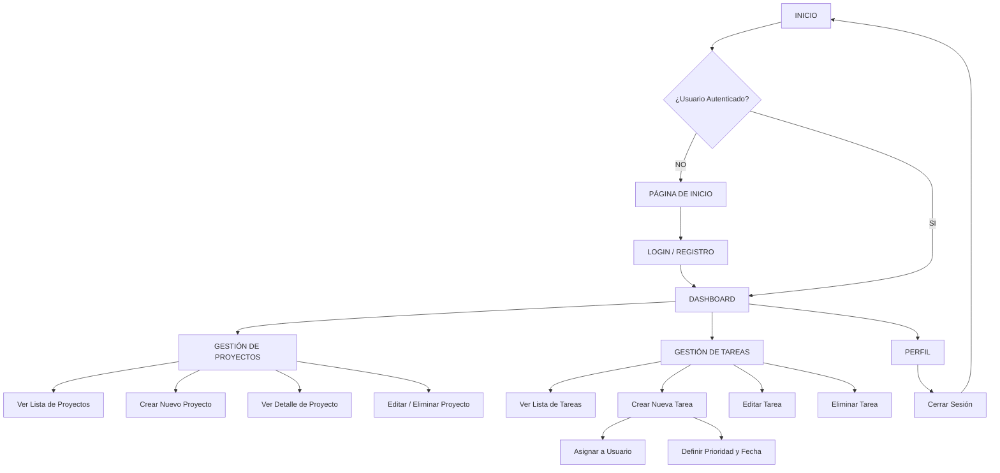

# Gestor de Tareas (Task Manager) - ABP 6

Este proyecto es una aplicación web desarrollada con Django para la gestión eficiente de proyectos y tareas. Permite a los usuarios registrarse, crear proyectos, asignar tareas, establecer prioridades y realizar un seguimiento del progreso a través de un dashboard interactivo.

## 📋 Descripción del Proyecto

El objetivo principal es proporcionar una herramienta colaborativa donde los usuarios puedan:
*   Organizar su trabajo en proyectos.
*   Desglosar proyectos en tareas específicas.
*   Asignar tareas a otros miembros del equipo.
*   Visualizar el estado de las tareas (pendientes, en progreso, completadas, vencidas).

## 🚀 Características Principales

*   **Autenticación de Usuarios**: Registro, inicio de sesión y cierre de sesión seguros.
*   **Gestión de Proyectos (CRUD)**: Crear, leer, actualizar y eliminar proyectos.
*   **Gestión de Tareas (CRUD)**:
    *   Asignación de prioridades (Baja, Media, Alta, Urgente).
    *   Fechas de vencimiento con validación.
    *   Estados de tarea (Pendiente, En Progreso, Completada).
*   **Dashboard Interactivo**:
    *   Contadores de tareas pendientes, vencidas y completadas.
    *   Listas de proyectos y tareas recientes.
*   **Permisos**:
    *   Los usuarios solo ven sus propios proyectos o los que tienen asignados.
    *   Validación para que solo el creador o asignado pueda editar.
*   **Interfaz Gráfica**: Diseño responsivo y moderno utilizando **Bootstrap 5**.
*   **Administración Avanzada**: Panel de control personalizado para gestionar usuarios, proyectos y tareas con filtros y búsquedas.
*   **Calidad de Código**:
    *   Validaciones robustas en modelos y formularios.
    *   Pruebas unitarias integradas.

## 🛠️ Tecnologías Utilizadas

*   **Lenguaje**: Python 3.13
*   **Framework Web**: Django 6.0.2
*   **Base de Datos**: SQLite (por defecto en Django)
*   **Frontend**: HTML5, CSS3, Bootstrap 5
*   **Control de Versiones**: Git

## 📊 Diagrama de Flujo



## ⚙️ Instalación y Configuración

Sigue estos pasos para ejecutar el proyecto en tu entorno local:

### 1. Clonar el repositorio
```bash
git clone https://github.com/MAGR1990/ABP-6.git
cd "ABP 6"